<br><br>



Full-Stack Developer with **6+ years** building high-performance, scalable web solutions. Specialized in the **TypeScript/React/Node.js** ecosystem, now focused on **Web3** — writing Rust smart contracts on **Stellar/Soroban**. 🏆 **1st place** at Blockchain Hackathon Buenos Aires 2025 with a fully functional DApp. Previously led teams of **20+ developers** as Technical Lead. Co-founder of **CuyoConnect**, Mendoza's tech builders community, and active mentor in Stellar ecosystem hackathons.



```text
[2025 — now ]  Freelance Full-Stack Developer ─ end-to-end web & Web3 DApps for media, retail & education
[2023 — 2024]  Full-Stack Developer @ ALQ Agency ─ full web cycle: UI/UX, frontend, backend, deploys
[2020 — 2022]  CEO & Technical Lead @ Patitas a Casa ─ led 20+ devs from conception to production
```



<p align="center">
  
</p>

```text
web3/  Stellar SDK · Soroban · Smart Contracts · DeFi · Blend
```



```text
lotty/               🏆 1st place ─ Blockchain Hackathon Buenos Aires 2025 · no-loss lottery DApp on Stellar
cuyoconnect/         🌐 Co-founder ─ tech builders community platform · OAuth, profiles & events
campus-downloader/   ⚡ Chrome extension ─ bulk downloads from university Moodle platforms
```



<p>
  <a href="https://linkedin.com/in/mauricio-medina-dev"></a>
  <a href="https://x.com/mauriHm_"></a>
  <a href="mailto:hh.mauri2190@gmail.com"></a>
</p>


```text
mauri@medina:~$ echo "Building from Mendoza, Argentina — at the foot of the Andes 🏔️"
```
